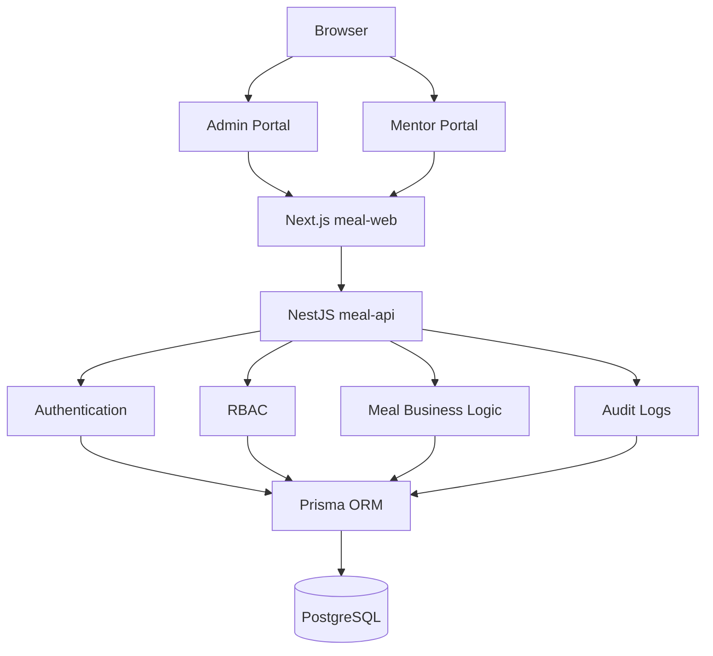

# SOFTWARE REQUIREMENTS SPECIFICATION (SRS)

# Part 4 — System Architecture & Domain Model

## 4.1 Overview

The **INSA Meal Management System (IMMS)** shall be designed as a modern, scalable, and configurable web application for managing meal distribution across multiple INSA training locations.

The architecture shall be modular, allowing future enhancements without requiring major structural changes.

The system must support:

- Multiple campuses
- Multiple programs
- Multiple academic years
- Multiple meal sessions
- Multiple user roles
- Thousands of students
- Hundreds of concurrent meal scans

The application shall use a single centralized database while logically isolating data between campuses and programs.

> **Implementation note:** An optional `Organization` tenant layer sits above Campus so the same codebase can serve multiple institutions without hard-coding INSA. Operational meal isolation remains campus- and program-scoped as described below.

## 4.2 High-Level Architecture

```text
                   Browser
                       │
          ┌────────────┴────────────┐
          │                         │
     Admin Portal             Mentor Portal
          │                         │
          └────────────┬────────────┘
                       │
                Next.js Frontend (meal-web)
                       │
                  REST API
                       │
                 NestJS Backend (meal-api)
                       │
      ┌──────────┬───────────┬──────────┐
      │          │           │          │
 Authentication  RBAC   Business Logic  Audit
      │          │           │          │
      └──────────┴───────────┴──────────┘
                       │
                Prisma ORM
                       │
                 PostgreSQL
```



## 4.3 System Modules

### Core

- Authentication
- Authorization (RBAC)
- User Management
- Audit Logs
- Settings

### Administration

- Campus Management
- Academic Year Management
- Program Management

### Student Management

- Students
- Excel Import
- Student Search
- Student Profiles

### Meal Management

- Meal Sessions
- Barcode Verification
- Meal Distribution
- Meal History
- Meal Overrides

### Reports

- Daily Reports
- Weekly Reports
- Campus Reports
- Mentor Reports
- Export

## 4.4 Domain Model

```text
Organization (tenant, optional multi-institution)
   │
   └──────── Campus
                │
                ├──────── AcademicYear
                │               │
                │               └──────── Program
                │                           │
                │                           ├──────── Student
                │                           ├──────── Mentor (User + role)
                │                           └──────── MealRecord
                │
                └──────── MealSessionConfig
```

## 4.5 Campus

A campus represents a physical training location (e.g. AASTU, Bahir Dar University, Jimma University).

Each campus owns programs, students, mentors, meal records, and reports.

| Field | Description |
| ----- | ----------- |
| ID | Primary key |
| Name | Full campus name |
| Short Name | Unique code within organization |
| Address | Street / site address |
| City | City |
| Status | Active / disabled |
| Created At / Updated At | Audit timestamps |

## 4.6 Academic Year

Separates historical data (e.g. 2026, 2027). Every program belongs to one academic year.

| Field | Description |
| ----- | ----------- |
| ID | Primary key |
| Name | Display name |
| Start Date / End Date | Optional bounds |
| Active (`isActive`) | Year open for operations |
| Current (`isCurrent`) | Marked as the working year |

## 4.7 Program

Training tracks (Cyber Security, AI, Development, etc.) belonging to one campus and one academic year.

| Field | Description |
| ----- | ----------- |
| ID | Primary key |
| Name | Program name |
| Campus ID | Parent campus |
| Academic Year ID | Parent year |
| Description | Optional |
| Capacity | Optional |
| Status | Active / archived / closed |

## 4.8 Student

Imported from official Excel. Student IDs are external (e.g. `CTC-1042-26`). **Student ID = barcode. The system never generates barcodes.**

| Field | Description |
| ----- | ----------- |
| Student ID | External identifier |
| Full Name | |
| Gender | |
| Department | |
| Education Level | |
| Campus / Program | Assignments |
| Barcode Value | Equals Student ID |
| Status | Active / inactive / … |

## 4.9 Mentor

Mentors (and Food Staff) operate meal stations as users with roles and campus assignments.

| Field | Description |
| ----- | ----------- |
| Name | |
| Email | Login identity |
| Phone | Optional |
| Role | Mentor / Food Staff / Admin / … |
| Campus | One or more assignments |
| Status | Account status |

## 4.10 Meal Session

Defines when meals can be served. Defaults: Breakfast, Lunch, Dinner. Times and grace periods are administrator-configurable (not hard-coded).

| Field | Description |
| ----- | ----------- |
| Code / Name | Stable key + display label |
| Start Time / End Time | Window |
| Grace Period | Extra minutes |
| Active | Enabled flag |

## 4.11 Meal Record

Created when a student successfully receives a meal. Becomes permanent audit history.

| Field | Description |
| ----- | ----------- |
| Student, Campus, Program, Academic Year | Context |
| Meal Session | Session code |
| Date, Week Number, Day, Time | When served |
| Mentor, Device | Who / how |
| Status, Notes | Served / overridden / … |

## 4.12 Barcode Verification Flow

```text
Student presents ID
          │
          ▼
Barcode Scanner
          │
          ▼
Barcode Value Read
          │
          ▼
Find Student
          │
          ▼
Student Found?
      │          │
     No         Yes
      │          │
 Show Error      ▼
           Check Current Meal Session
                  │
                  ▼
         Already Served Today?
            │             │
           Yes           No
            │             │
 Show Duplicate      Record Meal
            │             │
            ▼             ▼
      End Process   Success Message
```

## 4.13 Meal Distribution Rules

1. One breakfast per student per day  
2. One lunch per student per day  
3. One dinner per student per day  
4. Eligibility: campus, program, active status, current meal session  
5. Duplicate scans never create duplicate meal records  
6. Overrides require administrator permission and a mandatory reason  

## 4.14 Audit Architecture

Important events are logged and immutable (login, logout, meal served/edited/deleted, import, user created, override, etc.).

## 4.15 Scalability

Support unlimited campuses, years, programs, students, mentors, and millions of meal records via indexing, pagination, and efficient queries.

## 4.16 Design Principles

Modular architecture, separation of concerns, SOLID, DI, service layer, strict TypeScript, reusable UI, REST APIs, configuration-driven behavior.

## 4.17 Future Compatibility

Notifications, certificates, or attendance may be added later **without redesigning the core meal data model**. They are **out of scope** for the current release and must not be implemented now.
