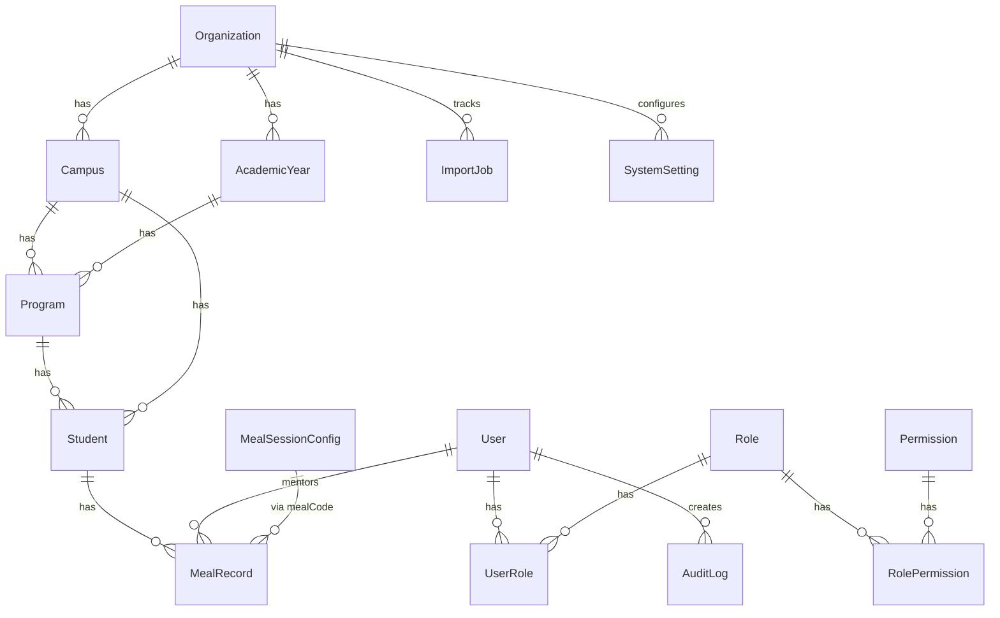

# SOFTWARE REQUIREMENTS SPECIFICATION (SRS)

# Part 5 — Database Design & Entity Relationships

## 5.1 Overview

The INSA Meal Management System (IMMS) shall use a **PostgreSQL relational database** with **Prisma ORM**.

The database must be fully normalized to reduce redundancy while maintaining high performance through indexing and optimized relationships.

Every table shall include:

- Primary Key
- Created At
- Updated At (where mutable)
- Soft Delete (`deletedAt`) where applicable

The database shall support:

- Multi-campus
- Multi-program
- Multiple academic years
- Multiple meal sessions
- Millions of meal records

> **Implementation note:** An optional `Organization` tenant layer sits above Campus so one deployment can serve multiple institutions. Operational uniqueness and isolation remain campus- and program-scoped as described below.

## 5.2 Database Design Principles

- UUID / CUID primary keys for internal entities (except externally issued student IDs)
- Foreign key constraints
- Cascade updates where appropriate
- Restrict deletes on critical operational records
- Soft deletes for business entities
- Indexed search columns
- Immutable audit and meal history records
- Timestamped records
- Database-level uniqueness constraints

## 5.3 Entity Relationship Diagram (Conceptual)

```text
Organization (tenant)
   │
   ├──── AcademicYear
   │
   └──── Campus ───────────────┐
                               │
                               ▼
                           Program
                           │      │
                           │      ▼
                           │   Student
                           │      │
                           │      ▼
                           │  MealRecord
                           │      ▲
                           │      │
                           ▼      │
                         User     │
                      (Mentor /   │
                       Food Staff)│
                                  │
MealSessionConfig ────────────────┘

User
 │
 ▼
UserRole
 │
 ▼
Role
 │
 ▼
RolePermission
 │
 ▼
Permission

AuditLog
ImportJob
SystemSetting
```



## 5.4 Campus

| Field | Type | Description |
| ----- | ---- | ----------- |
| id | UUID/CUID | Primary Key |
| organizationId | FK | Tenant |
| name | String | Campus name |
| shortName | String | Short code (unique per org) |
| address | String | Address |
| city | String | City |
| status | Enum | Active / Disabled / Archived |
| deletedAt | Timestamp | Soft delete |
| createdAt / updatedAt | Timestamp | |

**Relationships:** has many Programs, Students, Mentors (via assignments), Meal Records, Meal Session overrides.

## 5.5 Academic Year

| Field | Type |
| ----- | ---- |
| id | UUID/CUID |
| organizationId | FK |
| name | String |
| startDate / endDate | Date |
| isActive | Boolean |
| isCurrent | Boolean |
| deletedAt | Timestamp |
| createdAt / updatedAt | Timestamp |

**Relationship:** has many Programs.

## 5.6 Program

| Field | Type |
| ----- | ---- |
| id | UUID/CUID |
| campusId | FK |
| academicYearId | FK |
| name | String |
| description | Text |
| capacity | Integer |
| status | Enum |
| deletedAt | Timestamp |
| createdAt / updatedAt | Timestamp |

**Relationships:** belongs to Campus + Academic Year; has many Students and Meal Records.

## 5.7 Student

Student IDs are issued externally (e.g. `CTC-1042-26`) and used as the barcode. The system **never** generates barcodes.

| Field | Type |
| ----- | ---- |
| id | UUID/CUID |
| studentId | String (unique per organization) |
| barcode | String (unique per organization) |
| fullName | String |
| gender | String / reference (Male / Female) |
| department | String |
| educationLevel | String |
| campusId / programId / academicYearId | FK |
| status | Enum |
| deletedAt | Timestamp |
| createdAt / updatedAt | Timestamp |

**Indexes:** `studentId`, `barcode`, `fullName`, `department`, `campusId`, `programId`.

## 5.8 Mentor

Mentors are **Users** with Mentor / Food Staff roles and one or more campus assignments (`UserCampusAssignment`). There is no separate Mentor table.

| Field (User) | Type |
| ------------ | ---- |
| id | UUID/CUID |
| fullName | String |
| email | String (unique) |
| phone | String |
| status | Enum |
| deletedAt | Timestamp |
| lastLoginAt | Timestamp |
| createdAt / updatedAt | Timestamp |

## 5.9 User

Login accounts. Roles via `UserRole`. Campuses via `UserCampusAssignment`.

## 5.10 Role

| Field | Type |
| ----- | ---- |
| id | UUID/CUID |
| name | String |
| displayName | String |
| description | String |
| scopeKey | Platform or organization |

Examples: Super Admin, Admin, Mentor, Food Staff, Viewer.

## 5.11 Permission

| Field | Type |
| ----- | ---- |
| id | UUID/CUID |
| key | String (unique) |
| module | String |
| action | String |
| description | String |

Examples: `Student.View`, `Meal.Serve` / `Meal.Create`, `Meal.Override`, `Report.Export`, `Settings.Manage`.

## 5.12 UserRole

Bridge: `userId` + `roleId` (+ optional organization / validity window).

## 5.13 RolePermission

Bridge: `roleId` + `permissionId`.

## 5.14 Meal Session (`MealSessionConfig`)

Configurable windows (not hard-coded enums in application logic).

| Field | Type |
| ----- | ---- |
| id | UUID/CUID |
| organizationId | FK |
| campusId | FK (optional override) |
| code | String (BREAKFAST / LUNCH / DINNER / …) |
| name | String |
| startTime / endTime | Time (string HH:mm) |
| gracePeriod | Integer (minutes) |
| isActive | Boolean |
| deletedAt | Timestamp |

Defaults: Breakfast, Lunch, Dinner.

## 5.15 Meal Record

Most important operational table. One successful serve → one row.

| Field | Type |
| ----- | ---- |
| id | UUID/CUID |
| studentId | FK |
| campusId / programId / academicYearId | FK |
| mentorId | FK (User) |
| mealCode | String (session key; maps to MealSessionConfig.code) |
| mealDate | Date |
| servedAt | Timestamp |
| weekNumber | Integer (ISO week number) |
| dayOfWeek | String (day of week) |
| status | Enum |
| overrideReason | Text |
| notes | Text |

### Duplicate protection

```text
UNIQUE (studentId, mealDate, mealCode)
```

Guarantees one breakfast, one lunch, and one dinner per student per day — even under concurrent scanners.

Meal records are **not soft-deleted**. Corrections use the override process and remain in history.

## 5.16 Import History (`ImportJob`)

| Field | Type |
| ----- | ---- |
| id | UUID/CUID |
| uploadedById | FK |
| originalFile | String |
| totalRows | Integer |
| rowsImported / rowsFailed | Integer |
| status / mode | Enum |
| createdAt / completedAt | Timestamp |

Historical — never soft-deleted.

## 5.17 Audit Log

Immutable. Cannot be edited or deleted via the application.

| Field | Type |
| ----- | ---- |
| id | UUID/CUID |
| userId | FK |
| action | String |
| resource / resourceId | String |
| previousValue / newValue | JSONB |
| ipAddress / userAgent | String |
| timestamp | Timestamp |

## 5.18 System Settings

| Field | Type |
| ----- | ---- |
| key | String (unique per scope) |
| value | JSONB |
| description | String |
| scopeKey | Platform or organization |

Examples: theme, logo, timezone, camp/org name. Meal times live primarily in `MealSessionConfig`.

## 5.19 Enumerations

| Enum | Values |
| ---- | ------ |
| Account / User Status | Active, Inactive, Suspended, Locked, Pending Activation |
| Student Status | Active, Inactive, Graduated, Withdrawn, Suspended |
| Campus / Entity Status | Active, Disabled, Archived |
| Meal Session codes (default) | Breakfast, Lunch, Dinner |
| Meal Record Status | Served, Missed, Cancelled, Overridden |
| Gender (reference) | Male, Female |
| Days | Monday … Sunday |

## 5.20 Required Database Indexes

| Area | Indexes |
| ---- | ------- |
| Students | studentId, barcode, fullName, department |
| Meals | studentId, mealDate, mealCode, mentorId, campusId |
| Programs | campusId, academicYearId |
| Mentors / assignments | campusId (UserCampusAssignment) |
| Users | email (unique) |
| Audit Logs | timestamp, userId, resource, action |

## 5.21 Referential Integrity Rules

- A Program cannot exist without a Campus and Academic Year.
- A Student cannot exist without a Program (and Campus / Academic Year).
- A Meal Record cannot exist without a Student.
- A Meal Record must reference a valid meal session **code** for the organization.
- A User cannot be assigned a non-existent Role.
- Audit Log entries are never deleted.
- Meal Records are never hard-deleted; overrides update status with reason.

## 5.22 Soft Delete Policy

**Soft-delete (`deletedAt`):** Campus, Program, Academic Year, Student, User (Mentor), Meal Session Config.

**Never soft-delete (immutable history):** Meal Records, Audit Logs, Import History.

## 5.23 Data Integrity Rules

1. `studentId` is unique within an organization (system-wide for single-tenant INSA deployments).
2. `barcode` matches the externally assigned Student ID by default.
3. One meal per student per meal session per day (unique constraint).
4. Meal records are not updated/deleted ad hoc; corrections use logged overrides.
5. Foreign keys must reference existing parents; operational lists exclude soft-deleted rows.
